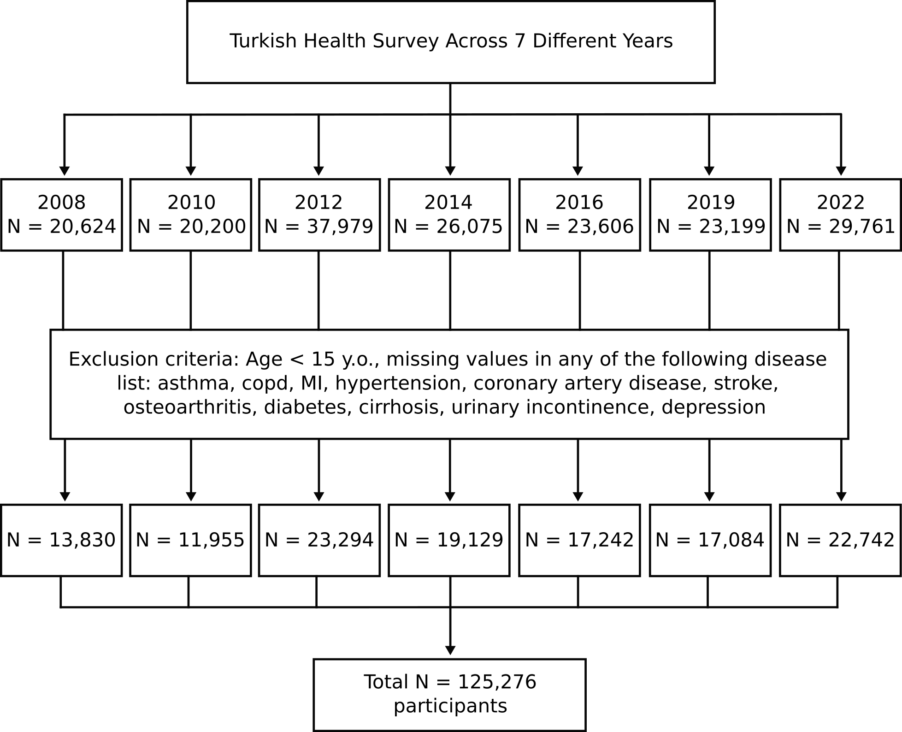
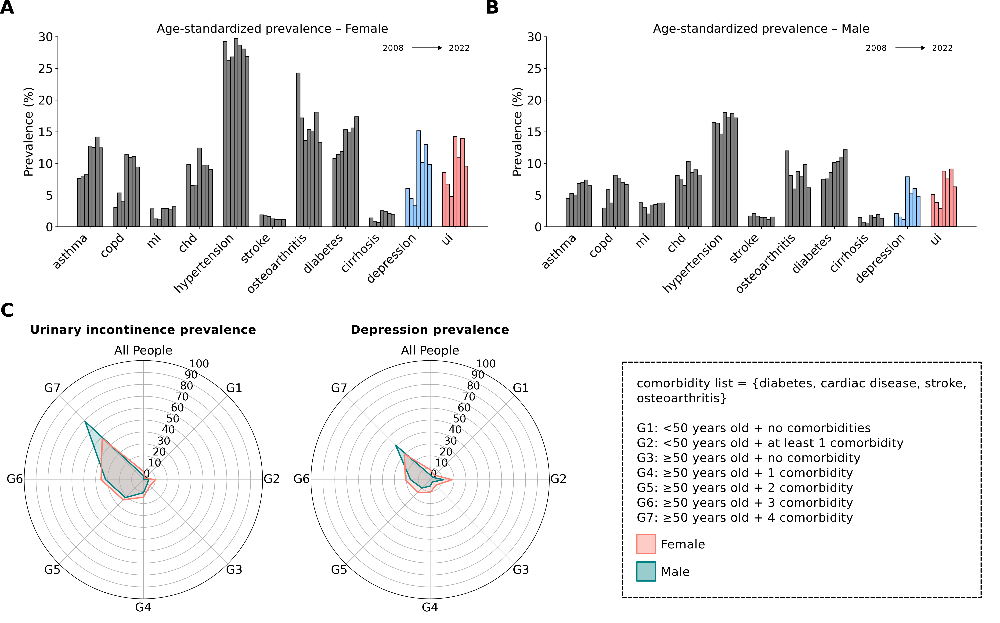
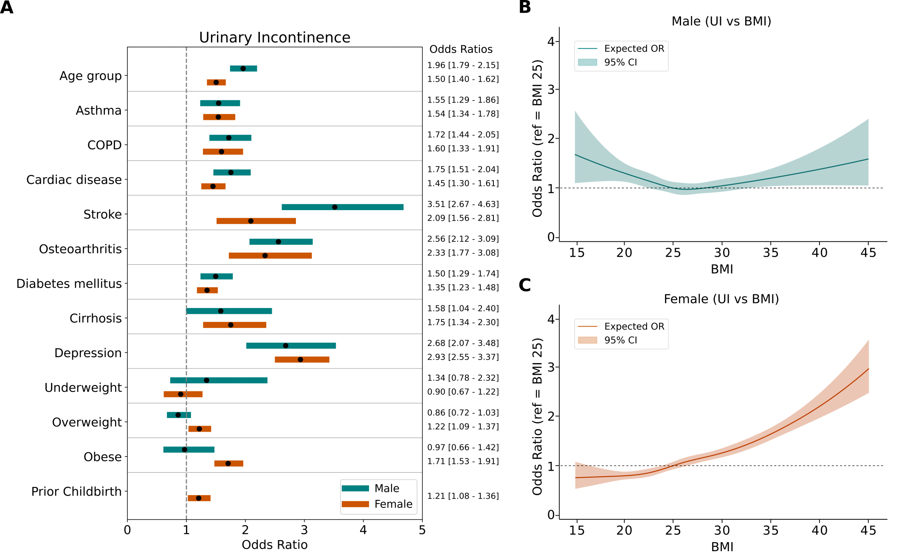
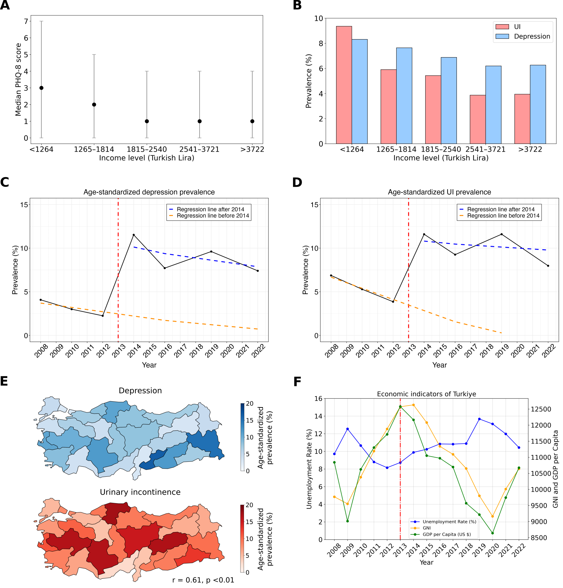

This repo includes codes for:
### 📝 Exploring the Association Between Urinary Incontinence and Depression Based on a Series of Large-Scale National Health Studies in Turkiye

**Authors**: Muhammed Furkan Dasdelen\*, Zehra Betul Dasdelen, Furkan Almas, Beyza Cokkececi, Pilar Laguna, Jean de la Rosette, Mehmet Kocak\*
 
**Article Link**: [journal of clinical medicine]()

---

### 📊 Project Summary

This repository contains the full codebase and data processing pipeline used to reproduce all statistical analyses and visualizations in our manuscript. Using nationally representative data from the Turkish Health Interview Surveys (2008–2022), we investigated:

- Temporal trends of urinary incontinence (UI) and depression
- Multivariable associations with demographic, socioeconomic, and health-related factors
- Gender-stratified analysis of BMI–UI association using restricted cubic splines
- Interrupted time series regression around the 2014 socioeconomic shift in Turkiye
- Regional and income-based disparities in UI and depression prevalence

---

### 📌 Key Figures

#### 📊 Figure 1 — Consort Diagram  
Flow chart of the study. A total of 125,276 participants were included in the study, after applying the exclusion criteria to the participants from 7 different years. For each year, separate multivariable logistic regression models were utilized to evaluate association of urinary incontinence and independent variables.

---

#### 📊 Figure 2 — Age-Standardized Prevalence of Diseases  
Urinary incontinence and depression prevalence increase with age and number of comorbidities in both sexes. Age-standardized prevalence of UI and depression followed similar trends over the years for both sexes (A, B). Each bar represents the prevalence of the condition in following year order: 2008, 2010, 2012, 2014, 2016, 2019 and 2022. Chronic diseases showed different temporal trends across years. The prevalence of UI and de-pression varied across different age and comorbidity subgroups. Separate radial plots were generated for UI and depression, each illustrating seven subgroups defined by age and number of comorbidities. Within the radial plots, each circle represents a 10 percent interval.

---

#### 📊 Figure 3 — UI and Chronic Conditions + BMI Analysis  
Age and chronic diseases associated with increase in urinary incontinence. BMI is a significant risk factor in females but not in males. Multivariable logistic regression was conducted separately for each year, with urinary incontinence as the dependent variable. Odds ratios were pooled for each independent variable. Age and all chronic conditions significantly increased the odds of urinary in-continence in both genders, while obesity was only associated with urinary incontinence in females (A). Restricted cubic spline (RCS) curves were drawn to visualize the UI-BMI association in males (B) and females (C). Solid lines represent expected odds ratio while shades show the 95% confidence interval.

---

#### 📊 Figure 4 — Impact of Micro/Macroeconomy on UI and Depression  
Effect of income and macroeconomic indicators on UI and depression prevalence. Median PHQ-8 scores by income level (A). Dots represent median values, while the gray line indicates the lower and upper quartiles. Prevalence of depression and urinary in-continence (UI) by income level, showing a decrease in both conditions as income in-creases (B). Interrupted time series analysis for depression (C) and UI (D). The vertical red line marks the event that disrupts the natural trend of the diseases. The orange dashed line depicts the underlying trend of prevalence prior to and projected after the event, assuming no disruption had occurred. The blue dashed line shows the trend of prevalence following the event. Changes in the levels between the orange and blue lines indicate the immediate impact of the event, while changes in the slopes represent its ongoing effects. Distribution of depression and UI prevalence across NUTS-2 regions (E). Visualization of the unemployment rate, GNI, and GDP per capita (F). Data sourced from TurkStat.

---

### ⚙️ Reproducibility

All analyses were conducted in **R** (v4.5) using packages:

- `survey` for complex design-based estimation
- `prais` for segmented regression (ITS)
- `rms` for restricted cubic spline modeling
- `metafor` for pooled odds ratio meta-analyses

> Note: Data access is restricted due to licensing from TurkStat. Authors may provide access upon request and with ethical approval.

---

### 📧 Contact

For questions, contact:

- Muhammed Furkan Dasdelen (muhammed.dasdelen@std.medipol.edu.tr)
- Mehmet Kocak (mehmetkocak@medipol.edu.tr)

---

### 📜 License

This work is licensed under [CC BY 4.0](https://creativecommons.org/licenses/by/4.0/).
